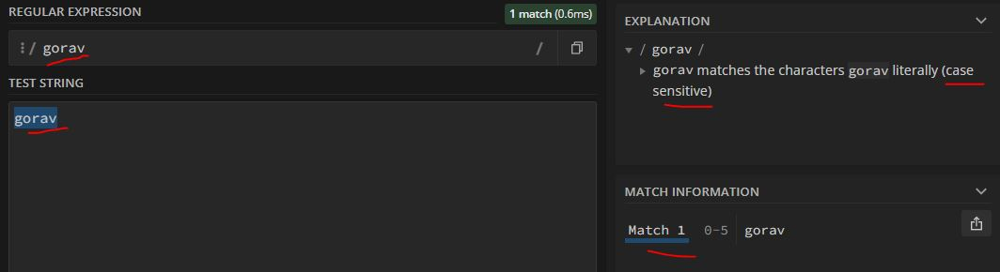
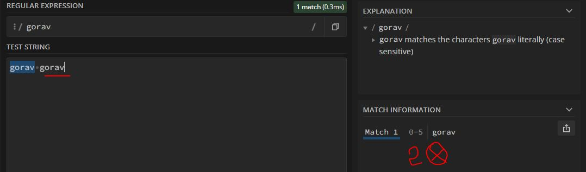
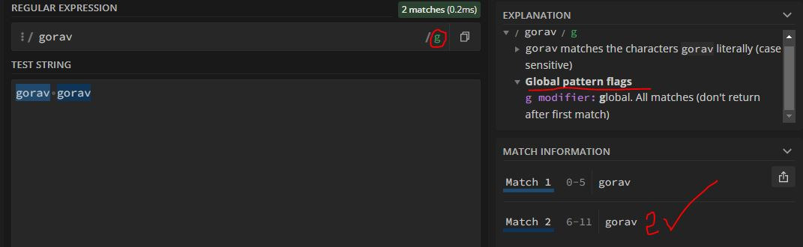
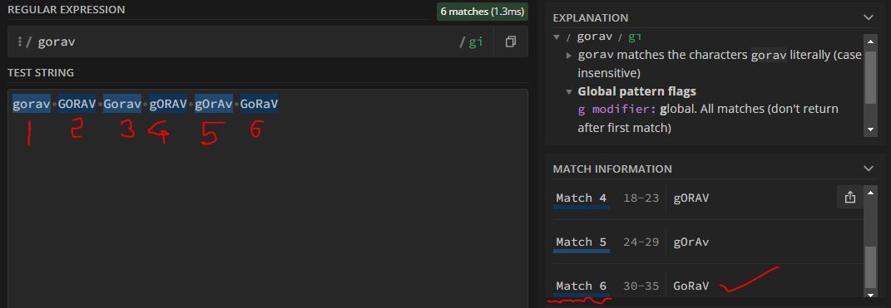

### https://regex101.com/ 

1. desected all flags, just typed a word

as we can see here we typed a word & it matches the string we given in regex bar

2. if we type same word twice?

looks like in default (without any flag) it only looks for first occurance only & case sensitive.

3. how to validate the multiple instance of same word then?

*by applying the global flag*

many of behaviour like this relay on the different different flags.
[Flag info](./Flags.md)

4. here is a quick look how global & insensitive flags work togather
