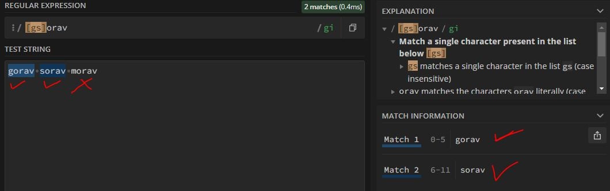

in last example we saw how regex engine  & its flag work by using "gorav" as string

### lets see now how we can include or exclude the character/characters for regex

# 1. Incusion
lets say, we want to have "gorav" & "sorav" both strings to be regex match.
we can put the character 'g' & 's' into [].

__[] : is a regular expression class which takes single memory for all the alternative you provided for__

```javascript
[g-s]orav
```

here [] is **character class** orav is a **String literal**



# 2. Exclusion

now lets say we want to exclude only character 'o' & other String literal which is "orav" will remain same

```javascript
[^oO]orav
```

here **[^oO]** **^** is a exclusion/negated operator.
[g] : means it will **only include g** as a character
[] : means it will include **anything** as a character
[^o] : means it will include **anything** as a character except **o**

in out cases in character class we passed o & O means capital or small no matter what it will exclude both Os from the expression.


