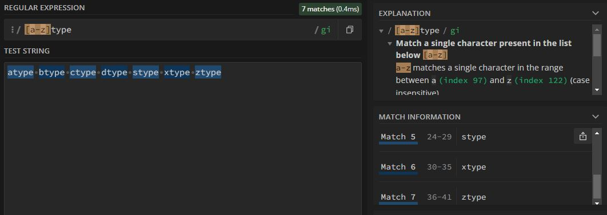
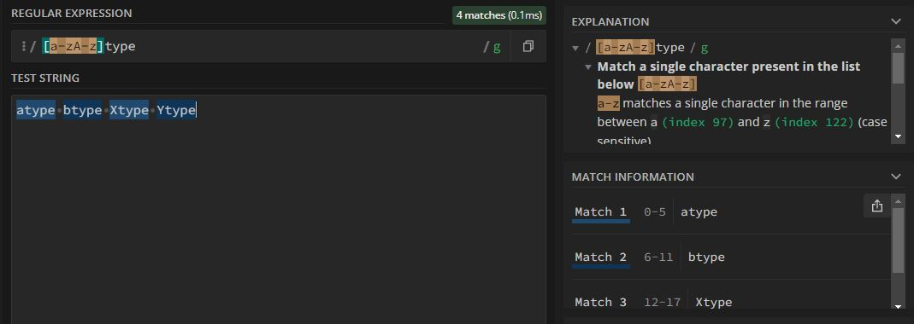
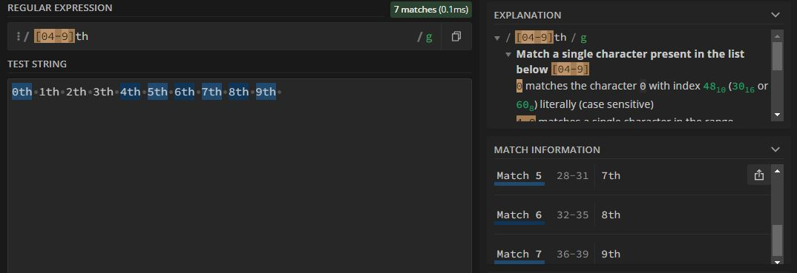

# Range in RegEx

```javascript
[abcdefghijklmnopqrstuvwxyz] type
```
this denotes the String literal "type" & can have all the lowercase characters from **a to z**
but this is more of a lengthy job & have the hight chances of a human errors
instead we can use range in regex.

```javascript 
[a-z]type
```


```javascript 
[a-zA-Z]type
```

now this will have capital & small both english alphabet in it. (no need of insensitive flag for that character)

```javascript 
[0123456789]type
```
is same as
```javascript 
[0-9]type
```

we know 0 & 4 to 9 number can have th as postfix while
1: 1st
2: 2nd
3: 3rd
```javascript 
[04-9]th
```

