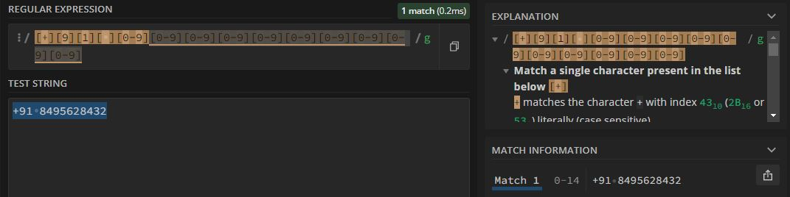
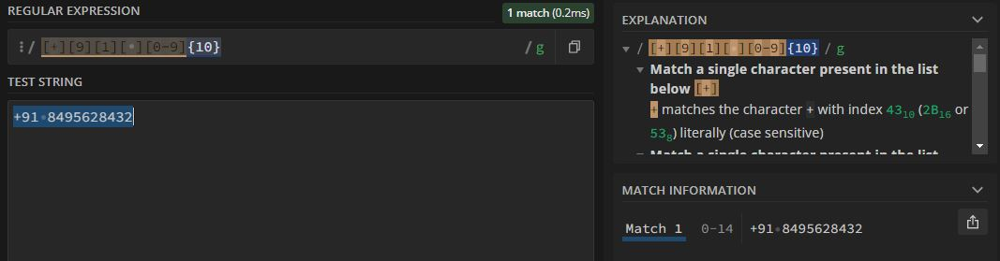

now we know we can use range operator **-** to specify the range of a desire
like
> [a-z] : lower case english letter a to z
> [A-G] : capital case english letter A to G
> [1-5] : engligh number from 1 to 5

using same logic can we do a indian phone number?
```javascript
// non optimal way
[+][9][1][ ][0-9][0-9][0-9][0-9][0-9][0-9][0-9][0-9][0-9][0-9]
```

this is good, we assign the country code of india which is +91 & gave the space between country code & 10 digit cell number which each have range from 0-9, although i never seen indian number started from digit 6 or lower 😆.

but again, as a previous example, its not a DRY example & can lead to human error.
```javascript
// optimal way
[+][9][1][ ][0-9]{10}
```

this way we can say (+91 ) part is same as previous, but
> [0-9]{10} : the character clas of [0-9] into times 10 which ultimately a 10 digit phone number.


>[0-9]+ : this means a character class of [0-9] can repeat itself between 1 to ♾️.